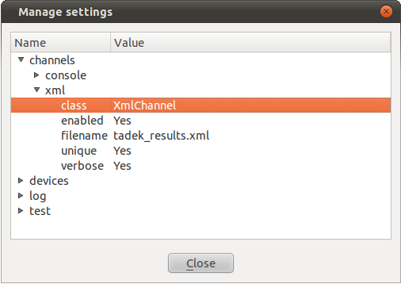

.. _configuration:

Configuration
*************

TADEK provides two ways of changing its configuration -- Manage settings dialog
of tadek-ui and tadek-conf command line tool.

Configuration spreads on multiple files of *INI* format and is split in two
categories:

* *common* -- configuration files that are used by all the tools of the framework
* Specific to a program -- configuration files that are defined exclusively for one tool: *tadek-ui*, *tadek-runner*, *tadek-explorer*

.. note::
    Some configuration files store internal settings that are maintained
    automatically and they should not be altered manually. These settings do
    not appear in the *Manage settings* dialog.

There are two levels of configuration:

* system -- the permanent default configuration provided by the installation. It is stored in */etc/tadek/config* on Linux or inside the *config* subdirectory of the installation directory on Windows.
* user -- can be modified by the user, it overrides the system configuration. It is stored in *.tadek/config* subdirectory of user's home directory.

Manage Setting Dialog of tadek-ui
=================================

The Manage Settings dialog is a user configuration editor. It displays the
configuration as a tree. Sections, options and option values are editable. 

Sections and options can be added or removed by selecting *Add* or *Remove*
options from context menu. The default value of an option that have been
changed can be restored by removing it and restarting tadek-ui.

.. _configuration_tadek-conf:

tadek-conf Command-Line Tool
============================

tadek-conf is a tool to manipulate the configuration common for all TADEK
tools (by default) or only for a selected one.

Usage::

    tadek-conf OPTION [ARGUMENT]...

Options
-------

.. program:: tadek-conf

.. cmdoption:: --version

    Show program's version number and exit.

.. cmdoption:: -h, --help

    Show this help message and exit.

.. cmdoption:: -p PROGRAM_NAME, --prog=PROGRAM_NAME

    Set the program name for which the configuration is read/modified

.. cmdoption:: -g, --get

    Get an option value or a list of available file names or sections or options of TADEK configuration.

.. cmdoption:: -s, --set

    Set an option value or create a file or a section or an option to TADEK configuration.

.. cmdoption:: -r, --remove

    Remove either a file or a section or an option from TADEK configuration.

.. cmdoption:: --reset

    Reset TADEK configuration to default one.

Examples
--------

Disabling the Console channel::

    $ tadek-conf -s channels console enabled No

Setting a custom port of the TADEK daemon::

    $ tadek-conf -p tadekd -s daemon connection port 5544

Restoring the default port of the TADEK daemon::

    $ tadek-conf -p tadekd --reset daemon connection port

Disabling auto-checking a device on the device list in Test view of
tadek-ui::

    $ tadek-conf -p tadek-ui -s test options check_on_connect No

.. _configuration_default:

Default Configuration
=====================

Common
------

+---------------+-----------------+-------------------+-------------------+------------------------------------------------------------------------------------------+
| Configuration | Section         | Option            | Default           | Description                                                                              |
+===============+=================+===================+===================+==========================================================================================+
| channels      |                                                         | | Configuration of test result channels.                                                 |
|               +-----------------+---------------------------------------+------------------------------------------------------------------------------------------+
|               | xml             |                                       | Options of the channel that saves test results as XML files.                             |
|               |                 +-------------------+-------------------+------------------------------------------------------------------------------------------+
|               |                 | class             | *XmlChannel*      | Name of the XML channel class.                                                           |
|               |                 +-------------------+-------------------+------------------------------------------------------------------------------------------+
|               |                 | enabled           | *Yes*             | Enables or disables the XML channel.                                                     |
|               |                 +-------------------+-------------------+------------------------------------------------------------------------------------------+
|               |                 | filename          |*tadek_results.xml*| Name of the file.                                                                        |
|               |                 +-------------------+-------------------+------------------------------------------------------------------------------------------+
|               |                 | unique            | *Yes*             | Makes file names unique by adding a string containing exact time and date of the         |
|               |                 |                   |                   | execution start.                                                                         |
|               |                 +-------------------+-------------------+------------------------------------------------------------------------------------------+
|               |                 | verbose           | *Yes*             | Determines whether the XML should contain all details or only basic fields.              |
|               +-----------------+-------------------+-------------------+------------------------------------------------------------------------------------------+
|               | console         |                                       | Options of the channel that writes test results to standard error output.                |
|               |                 +-------------------+-------------------+------------------------------------------------------------------------------------------+
|               |                 | class             | *StreamChannel*   | Name of the Stream channel class.                                                        |
|               |                 +-------------------+-------------------+------------------------------------------------------------------------------------------+
|               |                 | enabled           | *Yes*             | Enables or disables the Stream channel.                                                  |
|               |                 +-------------------+-------------------+------------------------------------------------------------------------------------------+
|               |                 | verbose           | *No*              | Determines whether details of each start and stop event should be written to the stream. |
|               +-----------------+-------------------+-------------------+------------------------------------------------------------------------------------------+
|               | coredumps       |                                       | Options of monitoring core dump files created during a test execution.                   |
|               |                 +-------------------+-------------------+------------------------------------------------------------------------------------------+
|               |                 | dirs              | *.*               | List of directories where dump files should be monitored (a daemon home directory,       |
|               |                 |                   |                   | by default).                                                                             |
|               |                 +-------------------+-------------------+------------------------------------------------------------------------------------------+
|               |                 | enabled           | *Yes*             | Enables or disables the monitoring.                                                      |
|               |                 +-------------------+-------------------+------------------------------------------------------------------------------------------+
|               |                 | links             | *No*              | Determines whether a directory can be a link or not.                                     |
|               |                 +-------------------+-------------------+------------------------------------------------------------------------------------------+
|               |                 | pattern           | *core*            | Regular expression pattern of core dump file name.                                       |
|               |                 +-------------------+-------------------+------------------------------------------------------------------------------------------+
|               |                 | recursive         | *No*              | Determines whether subdirectories should be searched or not.                             |
+---------------+-----------------+-------------------+-------------------+------------------------------------------------------------------------------------------+
| devices       |                                                         | Configuration of devices.                                                                |
|               |                                                         |                                                                                          |
|               |                                                         | It is recommended to use the                                                             |
|               |                                                         | :ref:`Manage devices dialog <environment_connecting_to_device>` rather than edit         |
|               |                                                         | this configuration.                                                                      |
|               +-----------------+---------------------------------------+------------------------------------------------------------------------------------------+
|               | localhost       |                                       | Options for connection with TADEK daemon that is set up in local system.                 |
|               |                 +-------------------+-------------------+------------------------------------------------------------------------------------------+
|               |                 | address           | *127.0.0.1*       | IP address of a local TADEK daemon service.                                              |
+               |                 +-------------------+-------------------+------------------------------------------------------------------------------------------+
|               |                 | port              | *8089*            | TCP port of a local TADEK daemon service.                                                |
+---------------+-----------------+-------------------+-------------------+------------------------------------------------------------------------------------------+
| log           |                                                         | | Configuration of the logger.                                                           |
|               +-----------------+---------------------------------------+------------------------------------------------------------------------------------------+
|               | FileHandler     |                                       | Options of the file logger that writes to .log files inside the *.tadek/log* directory.  |
|               |                 +-------------------+-------------------+------------------------------------------------------------------------------------------+
|               |                 | level             | *10*              | Minimal severity level of a log message that will be written to the file. The values of  |
|               |                 |                   |                   | levels are: *DEBUG* = ``10``, *INFO* = ``20``, *WARNING* = ``30``, *ERROR* = ``40``,     |
|               |                 |                   |                   | *CRITICAL* = ``50``.                                                                     |
|               |                 +-------------------+-------------------+------------------------------------------------------------------------------------------+
|               |                 | backups           | *10*              | Number of back-up log files that will be saved with appended extensions ``'.1'``,        |
|               |                 |                   |                   | ``'.2'`` etc. when the size of the main log file exceeds *maxbytes*.                     |
|               |                 +-------------------+-------------------+------------------------------------------------------------------------------------------+
|               |                 | maxbytes          | *10485760*        | Maximum size in byes that the log file can grow before it is truncated.                  |
|               |                 +-------------------+-------------------+------------------------------------------------------------------------------------------+
|               |                 | format            | *%(asctime)s -    | Format of a single log message. The keyword arguments are standard *LogRecord* attributes|
|               |                 |                   | %(name)s -        | that are documented in the `Python Standard Library documentation                        |
|               |                 |                   | %(levelname)s -   | <http://docs.python.org/library/logging.html#logrecord-attributes>`_.                    |
|               |                 |                   | %(module)s -      |                                                                                          |
|               |                 |                   | %(funcName)s -    |                                                                                          |
|               |                 |                   | %(lineno)d -      |                                                                                          |
|               |                 |                   | %(message)s*      |                                                                                          |
|               +-----------------+-------------------+-------------------+------------------------------------------------------------------------------------------+
|               | StreamHandler   |                                       | Options of the stream logger that writes to standard output.                             |
|               |                 +-------------------+-------------------+------------------------------------------------------------------------------------------+
|               |                 | level             | *30*              | Minimal severity level of a log message that will be written to the stream.              |
|               |                 +-------------------+-------------------+------------------------------------------------------------------------------------------+
|               |                 | format            | *%(levelname)s -  | See the *format* option in *FileHandler* section.                                        |
|               |                 |                   | %(message)s*      |                                                                                          |
+---------------+-----------------+-------------------+-------------------+------------------------------------------------------------------------------------------+

tadekd
------

+---------------+-----------------+-------------------+-------------------+------------------------------------------------------------------------------------------+
| Configuration | Section         | Option            | Default           | Description                                                                              |
+===============+=================+===================+===================+==========================================================================================+
| daemon        |                                                         | | Configuration of TADEK daemon.                                                         |
|               +-----------------+---------------------------------------+------------------------------------------------------------------------------------------+
|               | connection      |                                       | Connection options.                                                                      |
|               |                 +-------------------+-------------------+------------------------------------------------------------------------------------------+
|               |                 | address           | *0.0.0.0*         | IP address of TADEK daemon service. The default one makes tadekd listen on all available |
|               |                 |                   |                   | network interfaces.                                                                      |
|               |                 +-------------------+-------------------+------------------------------------------------------------------------------------------+
|               |                 | port              | *8089*            | TCP port of TADEK daemon service.                                                        |
+---------------+-----------------+-------------------+-------------------+------------------------------------------------------------------------------------------+

tadek-ui
--------

+---------------+-----------------+-------------------+-------------------+------------------------------------------------------------------------------------------+
| Configuration | Section         | Option            | Default           | Description                                                                              |
+===============+=================+===================+===================+==========================================================================================+
| explore       |                                                         | | Configuration of the Explore view of tadek-ui.                                         |
|               +-----------------+---------------------------------------+------------------------------------------------------------------------------------------+
|               | highlight       |                                       | Options related to highlight of widget tree items.                                       |
|               |                 +-------------------+-------------------+------------------------------------------------------------------------------------------+
|               |                 | enabled           | *No*              | Enables or disables the highlight.                                                       |
|               |                 +-------------------+-------------------+------------------------------------------------------------------------------------------+
|               |                 | mode              | *selection*       | Determines what part of a tree should be highlighted. Possible options are: *selection*  |
|               |                 |                   |                   | - only children of currently selected item are highlighted, *all* - all items in a tree  |
|               |                 |                   |                   | are highlighed.                                                                          |
|               |                 +-------------------+-------------------+------------------------------------------------------------------------------------------+
|               |                 | shading           | *5*               | Percentage of which the color of child items is darker related to their parent's color.  |
|               |                 +-------------------+-------------------+------------------------------------------------------------------------------------------+
|               |                 | red               | *0*               | Value of red component of RGB Color                                                      |
|               |                 +-------------------+-------------------+------------------------------------------------------------------------------------------+
|               |                 | green             | *255*             | Value of green component of RGB Color                                                    |
|               |                 +-------------------+-------------------+------------------------------------------------------------------------------------------+
|               |                 | blue              | *255*             | Value of blue component of RGB Color                                                     |
+---------------+-----------------+-------------------+-------------------+------------------------------------------------------------------------------------------+
| test          |                                                         | | Configuration of the Test view of tadek-ui.                                            |
|               +-----------------+---------------------------------------+------------------------------------------------------------------------------------------+
|               | options         |                                       | Various options.                                                                         |
|               |                 +-------------------+-------------------+------------------------------------------------------------------------------------------+
|               |                 | check_on_connect  | *Yes*             | Determines whether a connected device should be automatically checked on device list in  |
|               |                 |                   |                   | Test view.                                                                               |
|               |                 +-------------------+-------------------+------------------------------------------------------------------------------------------+
|               |                 | expand_on_refresh | *No*              | Determines whether the hierarchy of test cases defined in a location should be expanded  |
|               |                 |                   |                   | in the test tree when the Tes view is refreshed or when the location is selected.        |
+---------------+-----------------+-------------------+-------------------+------------------------------------------------------------------------------------------+
| result        |                                                         | | Configuration of the Result view of tadek-ui.                                          |
|               +-----------------+---------------------------------------+------------------------------------------------------------------------------------------+
|               | options         |                                       | Various options.                                                                         |
|               |                 +-------------------+-------------------+------------------------------------------------------------------------------------------+
|               |                 | expand_statuses   | *Error,Failed*    | List of execution statuses for which the results should be automatically expanded in a   |
|               |                 |                   |                   | result tree after a test execution is finished.                                          |
+---------------+-----------------+-------------------+-------------------+------------------------------------------------------------------------------------------+

