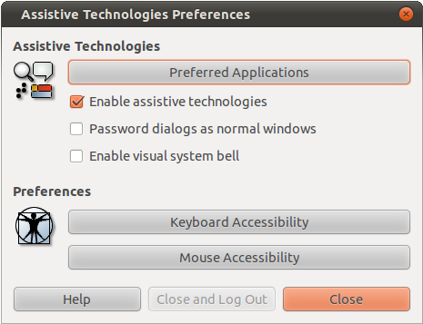
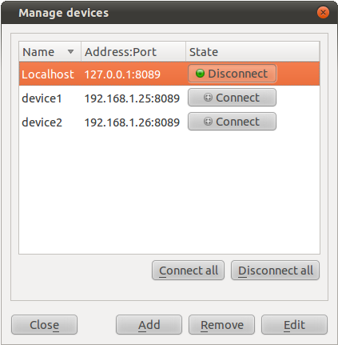
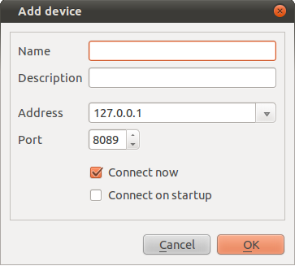

.. _environment:

Setting Up Tested Environment
*****************************

This chapter describes how to set up TADEK server on a device and how to
connect it from client applications.

Setting Up Accessibility
========================

.. Remove following line:

To gain access to widgets of a tested application, TADEK server uses plug-ins
that communicate with the application via accessibility. Currently TADEK is
equipped with two plug-ins:

.. csv-table::
    :header: **Plug-in**, **Interface**, **Interface description**
    :widths: 12, 12, 30

    tadek-a11y-pyspi, PySpi (>= 0.6.1), "An interface to the Gnome Accessibility through the CSPI library"
    tadek-a11y-pyatspi, PyAtSpi (>= 1.30.1), "An enhanced version of interface to the Gnome Accessibility"

All these plug-ins are equivalent and the decision which should be used
depends on the type of accessibility that is available for the operating system
of test device.

Packages for Debian, Ubuntu and Maemo:

    * :pkglink:`deb/tadek-a11y-pyspi_|version|.deb`
    * :pkglink:`deb/tadek-a11y-pyatspi_|version|.deb`

Installation command:

:pkgblock:`dpkg -i tadek-a11y-X_|version|.deb`

Package for MeeGo:

    * :pkglink:`rpm/tadek-a11y-pyatspi_|version|.rpm`

Installation command:

:pkgblock:`zypper install tadek-a11y-pyatspi_|version|.rpm`

When correct accessibility is installed, it is required to manually turn it on
in system preferences, e.g. in the GNOME desktop:

* Open :menuselection:`System --> Preferences --> Assistive Technologies` from the main menu
* Check *Enable assistive technologies* option
* Click *Close and Log Out* to save the setting and restart the Gnome session

Running tadekd
==============

tadekd is a daemon program that offers services for client-like TADEK tools:
tadek, tadek-explorer and tadek-ui. The tadekd daemon is intended for
executing operations requested by clients in a host system. The IP address and
TCP port on which tadekd will listen for client requests can be specified in
the configuration file (default or provided one). The default location is
.tadek/config/tadekd/daemon.conf in the home directory. If configuration does
not contain required data then tadekd will use the 0.0.0.0 IP address and
8089 TCP port. More information can be found in the
:ref:`configuration` chapter.

Usage::

    tadekd [OPTION]...

Options:

    .. cmdoption:: --version

        show program's version number and exit

    .. cmdoption:: -h, --help

        show this help message and exit

    .. cmdoption:: -c FILE, --config=FILE

        custom configuration file

    .. cmdoption:: --no-startup

        do not run start-up scripts

After the tested environment is configured, tadekd can to be run simply by
issuing the command::

    $ tadekd
    Running start-up scripts (if any)...
    Running start-up scripts finished... No scripts ran

    WARNING -- No attribute IP in daemon configuration file. Using default value 0.0.0.0
    WARNING -- No attribute port in daemon configuration file. Using default value 8089
    Daemon is running at 0.0.0.0:8089

Optional shell scripts can be placed in */etc/tadek/startup* directory. They
will be run along with tadekd unless the *--no-startup* option is provided.

.. _environment_connecting_to_device:

Connecting to Device
====================

To establish a connection between tadekd and a client application, a device
configuration have to be defined. It can be done either from the *Manage
Devices* dialog of tadek-ui or by using tadek-conf command line tool.

.. hint::

	The *localhost* device provided by the
	:ref:`default configuration<configuration_default>` can be used by a client
	to connect to a locally installed tadekd. 

.. _environment_manage_devices_dialog:

Manage Devices Dialog of tadek-ui
---------------------------------

The *Manage Devices* dialog allows user to add, delete, reconfigure devices
and manipulate their connection states. Device configuration is stored in
*devices.conf* file. The dialog can be opened by selecting
:menuselection:`Edit --> Devices` menu option or from the toolbar. It shows a
list of defined devices and provides a couple of buttons for managing the list.

A list entry represents a single device:

* Display name of the device
* Address and port of remote device on which the tadekd is running
* Connection state button with a green icon when the device is connected or gray icon when it is not connected

A device can be connected and disconnected by toggling the state button. After
a device is successfully connected, it turns available in the views:

* A device tab containing device widget tree is created in the Explore view
* An item is added to device list in the Test view
 
Buttons of device manager are described below.

* *Add* -- open Add device dialog, where user enters a name, description and connection parameters. If the device is added successfully, it is saved to configuration file and will be available on the list each time tadek-ui is run.
* *Remove* -- it is active only when a device has been selected first. Clicking on this button permanently removes the device from the list and from the configuration file so it won't appear on the list after after tadek-ui is reloaded.
* *Configure* -- open Device configuration dialog, where user can change all device parameters including connection options.
* *Connect all* -- try to connect all devices on the list. If some devices cannot be connected, their state will remain inactive.
* *Disconnect all* -- close connection with all devices from the list.

Adding a Device
+++++++++++++++

After clicking on the *Add* button, the *Add device* dialog appears:
 

In order to add a new device, following fields have to be filled:

* *Name* -- unique name of the device
* *Description* (optional)
* *Address* -- IP address or domain name of the device
* *Port* -- port number on which tadek-daemon is configured to run on the device
* *Connect now* -- forces to connect the device after closing the dialog with OK button
* *Connect on startup* -- if this option is checked, the device manager will automatically try to connect with device on application startup

Removing a Device
+++++++++++++++++

A device can be removed by selecting it on device list and clicking *Remove*
button. If the device is connected, connection will be automatically closed
causing the application views to discard all actions related to that device and
e.g. to remove the device tab. After removal, the device is permanently deleted
from configuration.

Reconfiguring a Device
++++++++++++++++++++++

Device parameters set while its addition can be altered by selecting an item on
device list and clicking *Configure* button. All parameters can be changed
including the name, as long as the new name has not been already used by
another device.

tadek-conf tool
---------------

Devices configured in tadek-ui can also be used with tadek and tadek-explorer
command line tools, however, if tadek-ui is not installed, devices can be
set with tadek-conf. More information can be found in the
:ref:`configuration_tadek-conf` section. Following command adds a device named
*device1* with address *192.168.1.25* and port 8089::

    $ tadek-conf -s devices device1 address 192.168.1.25
    $ tadek-conf -s devices device1 port 8089
