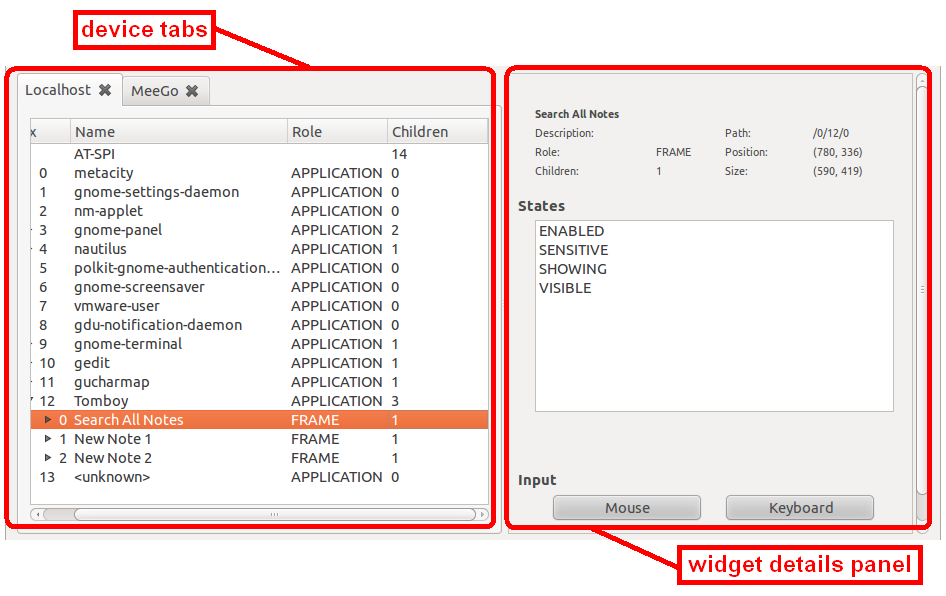
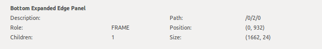

.. _models:

Creating Application Models
***************************

An application which usually consists of widgets is described  in TADEK by an
abstract definition termed a model. This definition is used to write test
cases, which isolates them from the actual content. When an application's UI
changes, a common scenario in the development phase, usually only the model has
to be updated, leaving hundreds or thousands of test cases untouched. Models
are also 'smart' with searchers, some UI changes may not even require a
single alteration to the model.

Simple Model
============

A simple model can be created within few lines of code. The following model
represents a *helloworld* application that has a window with two buttons:
*OK* and *Cancel*:

.. code-block:: python
    :linenos:
    
    from tadek.engine.searchers import *
    from tadek.engine.widgets import *
    from tadek.models import Model

    
    class HelloWorld(Model):
    
        root = App("helloworld", searcher("AT-SPI"), application("helloworld"))
        root.define("ok", Button(button__("OK")))
        root.define("cancel", Button(button__("Cancel")))

In lines 1-3 all required TADEK components are imported. Class *HelloWorld*
defines three widgets:

* Application itself -- the *root* widget
* Two child widgets:
    * *ok* button
    * *cancel* button

The ``searcher("AT-SPI")`` means that *helloworld* will be accessed through the
AT-SPI accessibility. The ``application("helloworld")`` tells TADEK to search
for an application named *helloworld*. Lines 9-10 show how to find buttons
inside the application, the ``__`` in ``button__("OK")`` or
``button__("Cancel")`` specifies that the button is located somewhere inside the
main application widget.

Exploring Test Application
==========================

TADEK perceives every application as a tree of widgets. This structure contains
a lot more widgets than a user can see in an application GUI. The reason for
this is that a widget usually is built from basic components which, in fact are
widgets too. Furthermore, some parts of a GUI can also be hidden while they are
still accessible by TADEK. Building a model is basically filtering only the key
widgets that the tests will interact with. TADEK provides two ways of exploring
application structure:

* Using Explore view of tadek-ui tool with GUI
* Using tadek-explorer command line interface tool

Explore View of tadek-ui
------------------------

Explore view layout is divided horizontally to device tabs and widget details
panel:

The *device tabs* area  contains  widget trees for connected devices. Widget
tree can be used to explore widget hierarchy on a single device. Top level
items represent accessibilities available on the device (e.g. *AT-SPI*). Second
level items correspond to applications in the accessibility. Application widgets
have their own child widgets, e.g. frames, buttons and so on. Each widget has:
index, name (e.g. *gnome-panel*), role (e.g. *APPLICATION*) and number of child
widgets (e.g. *3*). Device tab opens and closes automatically as the user
changes device connection state in the *Manage devices* dialog. User can also
close the current tab  by clicking the *Close* button on toolbar or by clicking
the middle mouse button on a tab header. The device will then automatically
disconnect.

To explore applications in tadek-ui:

* Connect a device in :ref:`Manage Devices <environment_manage_devices_dialog>` dialog
* Switch tadek-ui to Explore view

The connected device is represented as a tab to the left containing a tree of
widgets. Application items are right under the root (accessibility) item:

Expanding an application item and its child items reveals subsequent levels of
application widget structure. A widget usually has some of the following
properties shown in the right panel:

* :ref:`models_basic-information`
* :ref:`models_states`
* :ref:`models_attributes`
* :ref:`models_relations`
* :ref:`models_text`
* :ref:`models_value`
* :ref:`models_actions`

.. hint::

    The remote widget tree can be dumped to an XML file using the
    :menuselection:`File --> Save All` menu option. A part of the tree, e.g. an
    application or any other widget can be saved as well using the
    :menuselection:`File --> Save` option. The dumped hierarchy can be loaded
    and browsed off-line (without the remote device) with the
    :menuselection:`File --> Open` option.

.. _models_basic-information:

Basic Information
+++++++++++++++++

* Name
* Description
* Role
* Children -- number of child widgets
* Path -- made up of indices of parent widgets in the tree starting from the accessibility element
* Position -- coordinates of top left corner of a widget
* Size -- width and height of a widget

.. _models_states:

States
++++++

List of states that a widget is currently in:

.. _models_attributes:

Attributes
++++++++++

List of attributes of a widget:

.. _models_relations:

Relations
+++++++++

List of relations with other widgets:

.. _models_text:

Text
++++

Text of a widget:

If the *change* button is enabled, it indicates that the text is editable:

.. _models_value:

Value
+++++

Value of a widget:

If *change* button is enabled, it indicates that the value is editable:

.. _models_actions:

Actions
+++++++

Actions that are available to be taken on a widget:

Clicking on a button executes an action.

.. _models_events:

Hardware Events
+++++++++++++++

Explore view allows also to generate hardware input events:

Clicking a button opens a window:

* *MOUSE* -- opens a dialog where mouse button, mouse action and coordinates can be entered:

    .. image::  images/explore_rpanel_mouse.png
        :class: align-center

* *KEYBOARD* -- opens a dialog where key along with optional modifiers can be entered or chose from list:

    .. image:: images/explore_rpanel_keyboard.png
        :class: align-center

Search Dialog
+++++++++++++

Search dialog helps to find specific widgets inside the remote widget tree. It
can be open using the :menuselection:`Edit --> Search` menu option. The dialog
works much like a searcher -- it searches for a widget of specified properties
from among:

* Direct children of currently selected widget -- *Simple* method
* All descendants of currently selected widget -- *Deep* method  

Search criteria can include *Name*, *Role*, *State* and *Text*. Value of *Role*
and *State* can be either entered as a text or chosen from a predefined
drop-down list of values. The criteria that aren't left blank make a
conjunction.

tadek-explorer Command-Line Tool
--------------------------------

tadek-explorer is a command-line tool for interacting with UI elements which
uses accessibility. It also provides the possibility to send mouse and keyboard
events. tadek-explorer can be used both remotely and locally. Beside using
system configuration you can specify a device address to connect to in your
configuration file in home directory. A file
*.tadek/config/tadek-explorer/devices.conf* is used or, if it does not exist,
*.tadek/config/common/devices.conf*.

Example of a configuration file::

    [local]
    address=127.0.0.1
    port=48089

    [device1]
    address=192.168.254.128

General Options
+++++++++++++++

.. program:: tadek-explorer

.. cmdoption:: --version

    Show program's version number and exit.

.. cmdoption:: -h, --help

   Show help message and exit. 

.. cmdoption:: -d DEVICE, --device=DEVICE

    OPTIONAL. Connects to given device (*DEVICE*=IP[:port]|NAME*). Parameter *NAME* is section name from devices configuration file *devices.conf*. If this option is not specified it connects to default address *127.0.0.1:8089*.

.. cmdoption:: -p PATH, --path=PATH
    
    MANDATORY. Path to accessible object. Indexes separated by ``'/'`` character. Path always starts with ``'/'``.

.. cmdoption:: -o FILE, --output=FILE

    OPTIONAL. Saves dump to file. Requires one of options *--dump* or *--dump-all*.

Accessible Requests
+++++++++++++++++++

.. cmdoption:: --dump=DEPTH

    Shows tree of accessible elements starting from element given in path
    attribute. Depth means how deep the tree will be (*--depth* = ``-1`` means
    that all descendants will be get, equivalent to *--dump-all*).

.. cmdoption:: --dump-all

    Shows all accessible elements with all their children starting from element
    given in path attribute. It is equivalent to option *--dump*. with depth
    ``-1``.

.. cmdoption:: --all

    Shows all available information about object.

.. cmdoption:: --description

    Shows object description.

.. cmdoption:: --position

    Shows object position if available.

.. cmdoption:: --size

    Shows object size if available.

.. cmdoption:: --text

    Shows object text content if available.

.. cmdoption:: --value

    Shows object current, minimum and maximum values if available.

.. cmdoption:: --relations

    Shows object relations if available.

.. cmdoption:: --states

    Shows object states if available.

.. cmdoption:: --actions

    Shows object actions if available.

.. cmdoption:: --attributes

    Shows object attributes if available.

.. cmdoption:: --set-text=TEXT

    Sets object text content.

.. cmdoption:: --set-text-file=FILE

    Sets object text content from given file.

.. cmdoption:: --set-value=VALUE

    Sets object current value.

.. cmdoption:: --action=ACTION

    Execute action on object. Needs action name to work.It can be used only
    once.

Mouse Event Requests
++++++++++++++++++++

Following options can be used to generate mouse events. All events require coordinates. Options *--mouse-click*, *--mouse-double-click*, *--mouse-press* and *--mouse-release* require the option *--button*. Options *--mouse-absolute-motion* and *--mouse-relative-motion* forbid the option *--button*.

.. cmdoption:: --mouse-click=X Y

    Executes mouse *CLICK* request on given integer coordinates.

.. cmdoption:: --mouse-double-click=X Y

    Executes mouse *DOUBLE_CLICK* request on given integer coordinates.

.. cmdoption:: --mouse-press=X Y

    Executes mouse *PRESS* request on given integer coordinates.

.. cmdoption:: --mouse-release=X Y

    Executes mouse *RELEASE* request on given integer coordinates.

.. cmdoption:: --mouse-absolute-motion=X Y

    Moves mouse cursor to given integer coordinates.

.. cmdoption:: --mouse-relative-motion=X Y

    Moves mouse cursor by given vector.

.. cmdoption:: --button=BUTTON

    Mouse button name.

Keyboard Event Requests
+++++++++++++++++++++++

Following options can be used to generate keyboard events. It consists of a key symbol or a single character or a keycode and an optional list of modifier symbols (e.g. ``LEFT_SHIFT``, ``RIGHT_ALT``). The keycode should be written as a hexadecimal number (starting with ``0x``).

.. cmdoption:: --key=KEYSYM|KEYCODE|SINGLE_CHARACTER

    Key symbol or keycode or single character.

.. cmdoption:: --mod=KEYSYM

    Modifier symbol. Can be added multiple times.

Examples
++++++++

Connecting to the local machine on port 8089 and showing all elements with
their children starting from element given in path as tree root::

    $ tadek-explorer --path=/0/11/3/0/0/0/2 --device=127.0.0.1:8089 --dump-all
    ---------------------------------------------------
           PATH      |     NAME     |   ROLE  |CHILDREN
    ---------------------------------------------------
    /0/11/3/0/0/0/2  |Open Terminal |MENU     |4       
    /0/11/3/0/0/0/2/0|              |UNKNOWN  |0       
    /0/11/3/0/0/0/2/1|0. Default    |MENU_ITEM|0       
    /0/11/3/0/0/0/2/2|1. transparent|MENU_ITEM|0       
    /0/11/3/0/0/0/2/3|Empty         |MENU_ITEM|0       

Connecting to the local (default) device and showing all elements with their
children. It is a full dump (output was truncated to fit here)::

    $ tadek-explorer -p / --dump-all
    -------------------------------------------------------
           PATH       |     NAME    |   ROLE      |CHILDREN
    -------------------------------------------------------
    /0                |AT-SPI       |             |18      
    /0/0              |wnck-applet  |APPLICATION  |1       
    /0/0/0            |             |WINDOW       |0       
    
    ...

Connecting to device *testdevice* given in the configuration file and showing
first accessibility element with applications as its children::

    $ tadek-explorer -d testdevice --path /0 --dump 1
    --------------------------------------------------------------
     PATH|                NAME               |    ROLE   |CHILDREN
    --------------------------------------------------------------
    /0   |AT-SPI                             |           |18      
    /0/0 |gnome-session                      |APPLICATION|0       
    /0/1 |gnome-power-manager                |APPLICATION|0       
    /0/2 |metacity                           |APPLICATION|0       
    /0/3 |polkit-gnome-authentication-agent-1|APPLICATION|0       
    /0/4 |nm-applet                          |APPLICATION|0       
    /0/5 |gnome-settings-daemon              |APPLICATION|0       
    /0/6 |gnome-panel                        |APPLICATION|2       
    /0/7 |vmware-user                        |APPLICATION|0       
    /0/8 |gnome-screensaver                  |APPLICATION|0       
    /0/9 |gdu-notification-daemon            |APPLICATION|0       
    /0/10|wnck-applet                        |APPLICATION|1       
    /0/11|gnome-terminal                     |APPLICATION|4       
    /0/12|nautilus                           |APPLICATION|1       
    /0/13|notify-osd                         |APPLICATION|0       
    /0/14|nautilus-connect-server            |APPLICATION|1       
    /0/15|gedit                              |APPLICATION|2       
    /0/16|Firefox                            |APPLICATION|1       

Connecting to the local (default) device and showing size of a widget::

    $ tadek-explorer -p /0/6/1/0/0/0/0 --size
    --------------------------------------------------------------------------------
    PATH: /0/6/1/0/0/0/0
    NAME: 
    ROLE: MENU_BAR
    CHILDREN: 3

    SIZE: (236, 24)

Connecting to the local (default) device and inserting content of *text.txt* to
element given in path::

    $ tadek-explorer --set-text-file=text.txt --path /0/15/1/0/2/1/0/3/0/0/0
    --------------------------------------------------------------------------------
    SUCCESS

Connecting to the local (default) device and executing an action ``click`` on
element given in path. It should work if element is for example button::

    $ tadek-explorer --action click --path /0/15/0/0/0/0/1
    --------------------------------------------------------------------------------
    SUCCESS

Connecting to the local (default) device and executing left mouse button click
in screen coordinates ``(10, 15)`` on accessibility given in *--path*
argument::

    $ tadek-explorer --mouse-click 10 15 --button=LEFT --path /0
    --------------------------------------------------------------------------------
    SUCCESS

Widgets -- Representing UI Elements
===================================

Widgets in TADEK are objects that represent actual widgets of a tested
application inside its model. The interface they provide includes querying
various widget attributes, modifying them, executing actions, generating mouse
and keyboard events on the remote widget. Apart from a basic
:epylink:`~tadek.engine.widgets.Widget`, more specialized widgets are
available:

.. csv-table::
    :header: **Widget**, **Usage**, **Additional capabilities**
    :widths: 15, 35, 50
    
    :epylink:`~tadek.engine.widgets.App`, "Applications", "Launching, closing and checking whether it is launched and closed"
    :epylink:`~tadek.engine.widgets.Dialog`, "Windows and dialogs", "Checking whether it is launched and closed"
    :epylink:`~tadek.engine.widgets.Button`, "Various clickable components", "Clicking, Pressing and Releasing"
    :epylink:`~tadek.engine.widgets.Menu`, "Main menus", "Clicking"
    :epylink:`~tadek.engine.widgets.PopupMenu`, "Pop-up menus", "Popping up"
    :epylink:`~tadek.engine.widgets.MenuItem`, "Items of various menus", "Clicking"
    :epylink:`~tadek.engine.widgets.Entry`, "Text edits, line edits and other text inputs", "Typing"
    :epylink:`~tadek.engine.widgets.Valuator`, "Spin boxes, sliders, scroll bars etc.", "Getting and setting value"
    :epylink:`~tadek.engine.widgets.Link`, "hyperlinks", "Jumping"
    :epylink:`~tadek.engine.widgets.Container`, "Components containing similar items", "Iterating, getting selected item"

The specialized widget classes define additional methods that interface
functionalities of respective remote widgets.

Searchers
=========

The mechanism that filters a remote widget tree and binds the key widgets to
:epylink:`tadek.engine.widgets.Widget` objects as parts of a model is based on
searchers. Searchers are used to build chains -- sequences that are provided to
initializer of a :epylink:`tadek.engine.widgets.Widget`. Each searcher in such
chain has its target -- a widget with certain properties or contents. Widgets
found by successive searchers in a chain are somewhat `checkpoints` leading to
the destination widget. Since the model has a form of tree, only its topmost
widget has to be searched from the top of the hierarchy of remote widgets.
All other widgets of a model are defined relatively to that widget.

Available searcher classes are described below.

.. csv-table::
    :header: **Searcher**, **Usage**
    :widths: 10, 55

    :epylink:`~tadek.engine.searchers.searcher`, "A class of general searchers. Searcher can find any widget that has specified features in children of a given parent widget."
    :epylink:`~tadek.engine.searchers.searcher_back`, "A class of general backward searchers. Backward searcher can find any widget that has specified features in children of a given parent widget starting from the last one child widget."
    :epylink:`~tadek.engine.searchers.searcher__`, "A class of general deep searchers. A deep searcher can find any widget that has specified features in all descendants of a given parent widget, searching level by level with use of the Breadth-first search algorithm."
    :epylink:`~tadek.engine.searchers.structure`, "A class of structure searchers. A structure searcher searches in children of a given parent widget of specified features that is a root of a structure of widgets defined by a given list of searchers."
    :epylink:`~tadek.engine.searchers.structure_back`, "A class of backward structure searchers. A backward structure searcher searches in children of a given parent widget starting from a last one a widget of specified features that is a root of a structure of widgets defined by a given list of searchers."
    :epylink:`~tadek.engine.searchers.structure__`, "A class of deep structure searchers. A deep structure searcher searches in all descendants of a given parent widget of specified features that is a root of a structure of widgets defined by a given list of searchers."

Role Searchers
--------------

For convenience, variants of :epylink:`~tadek.engine.searchers.searcher` and
:epylink:`~tadek.engine.searchers.searcher__` have been defined for each role:

.. csv-table::
    :header: **role**, **searcher**, **searcher\_\_**
    :widths: 50, 50, 50

    ALERT, :epylink:`~tadek.engine.searchers.alert`, :epylink:`~tadek.engine.searchers.alert__`
    APPLICATION, :epylink:`~tadek.engine.searchers.application`, :epylink:`~tadek.engine.searchers.application__`
    BUTTON, :epylink:`~tadek.engine.searchers.button`, :epylink:`~tadek.engine.searchers.button__`
    CHECK_BOX, :epylink:`~tadek.engine.searchers.checkbox`, :epylink:`~tadek.engine.searchers.checkbox__`
    CHECK_MENU_ITEM, :epylink:`~tadek.engine.searchers.checkmenuitem`, :epylink:`~tadek.engine.searchers.checkmenuitem__`
    COMBO_BOX, :epylink:`~tadek.engine.searchers.combobox`, :epylink:`~tadek.engine.searchers.combobox__`
    DIALOG, :epylink:`~tadek.engine.searchers.dialog`, :epylink:`~tadek.engine.searchers.dialog__`
    DOCUMENT_FRAME, :epylink:`~tadek.engine.searchers.documentframe`, :epylink:`~tadek.engine.searchers.documentframe__`
    DRAWING_AREA, :epylink:`~tadek.engine.searchers.drawingarea`, :epylink:`~tadek.engine.searchers.drawingarea__`
    ENTRY, :epylink:`~tadek.engine.searchers.entry`, :epylink:`~tadek.engine.searchers.entry__`
    FILLER, :epylink:`~tadek.engine.searchers.filler`, :epylink:`~tadek.engine.searchers.filler__`
    FORM, :epylink:`~tadek.engine.searchers.form`, :epylink:`~tadek.engine.searchers.form__`
    FRAME, :epylink:`~tadek.engine.searchers.frame`, :epylink:`~tadek.engine.searchers.frame__`
    HEADING, :epylink:`~tadek.engine.searchers.heading`, :epylink:`~tadek.engine.searchers.heading__`
    ICON, :epylink:`~tadek.engine.searchers.icon`, :epylink:`~tadek.engine.searchers.icon__`
    IMAGE, :epylink:`~tadek.engine.searchers.image`, :epylink:`~tadek.engine.searchers.image__`
    LABEL, :epylink:`~tadek.engine.searchers.label`, :epylink:`~tadek.engine.searchers.label__`
    LINK, :epylink:`~tadek.engine.searchers.link`, :epylink:`~tadek.engine.searchers.link__`
    LIST, :epylink:`~tadek.engine.searchers.list`, :epylink:`~tadek.engine.searchers.list__`
    LIST_ITEM, :epylink:`~tadek.engine.searchers.listitem`, :epylink:`~tadek.engine.searchers.listitem__`
    MENU, :epylink:`~tadek.engine.searchers.menu`, :epylink:`~tadek.engine.searchers.menu__`
    MENU_BAR, :epylink:`~tadek.engine.searchers.menubar`, :epylink:`~tadek.engine.searchers.menubar__`
    MENU_ITEM, :epylink:`~tadek.engine.searchers.menuitem`, :epylink:`~tadek.engine.searchers.menuitem__`
    PAGE_TAB, :epylink:`~tadek.engine.searchers.pagetab`, :epylink:`~tadek.engine.searchers.pagetab__`
    PAGE_TAB_LIST, :epylink:`~tadek.engine.searchers.pagetablist`, :epylink:`~tadek.engine.searchers.pagetablist__`
    PANEL, :epylink:`~tadek.engine.searchers.panel`, :epylink:`~tadek.engine.searchers.panel__`
    PARAGRAPH, :epylink:`~tadek.engine.searchers.paragraph`, :epylink:`~tadek.engine.searchers.paragraph__`
    PASSWORD_TEXT, :epylink:`~tadek.engine.searchers.passwordtext`, :epylink:`~tadek.engine.searchers.passwordtext__`
    POPUP_MENU, :epylink:`~tadek.engine.searchers.popupmenu`, :epylink:`~tadek.engine.searchers.popupmenu__`
    PROGRESS_BAR, :epylink:`~tadek.engine.searchers.progressbar`, :epylink:`~tadek.engine.searchers.progressbar__`
    RADIO_BUTTON, :epylink:`~tadek.engine.searchers.radiobutton`, :epylink:`~tadek.engine.searchers.radiobutton__`
    RADIO_MENU_ITEM, :epylink:`~tadek.engine.searchers.radiomenuitem`, :epylink:`~tadek.engine.searchers.radiomenuitem__`
    SCROLL_BAR, :epylink:`~tadek.engine.searchers.scrollbar`, :epylink:`~tadek.engine.searchers.scrollbar__`
    SCROLL_PANE, :epylink:`~tadek.engine.searchers.scrollpane`, :epylink:`~tadek.engine.searchers.scrollpane__`
    SECTION, :epylink:`~tadek.engine.searchers.section`, :epylink:`~tadek.engine.searchers.section__`
    SEPARATOR, :epylink:`~tadek.engine.searchers.separator`, :epylink:`~tadek.engine.searchers.separator__`
    SLIDER, :epylink:`~tadek.engine.searchers.slider`, :epylink:`~tadek.engine.searchers.slider__`
    SPIN_BUTTON, :epylink:`~tadek.engine.searchers.spinbutton`, :epylink:`~tadek.engine.searchers.spinbutton__`
    SPLIT_PANE, :epylink:`~tadek.engine.searchers.splitpane`, :epylink:`~tadek.engine.searchers.splitpane__`
    STATUS_BAR, :epylink:`~tadek.engine.searchers.statusbar`, :epylink:`~tadek.engine.searchers.statusbar__`
    TABLE, :epylink:`~tadek.engine.searchers.table`, :epylink:`~tadek.engine.searchers.table__`
    TABLE_CELL, :epylink:`~tadek.engine.searchers.tablecell`, :epylink:`~tadek.engine.searchers.tablecell__`
    TABLE_COLUMN_HEADER, :epylink:`~tadek.engine.searchers.tablecolumnheader`, :epylink:`~tadek.engine.searchers.tablecolumnheader__`
    TEXT, :epylink:`~tadek.engine.searchers.text`, :epylink:`~tadek.engine.searchers.text__`
    TOGGLE_BUTTON, :epylink:`~tadek.engine.searchers.togglebutton`, :epylink:`~tadek.engine.searchers.togglebutton__`
    TOOL_BAR, :epylink:`~tadek.engine.searchers.toolbar`, :epylink:`~tadek.engine.searchers.toolbar__`
    TREE, :epylink:`~tadek.engine.searchers.tree`, :epylink:`~tadek.engine.searchers.tree__`
    TREE_TABLE, :epylink:`~tadek.engine.searchers.treetable`, :epylink:`~tadek.engine.searchers.treetable__`
    UNKNOWN, :epylink:`~tadek.engine.searchers.unknown`, :epylink:`~tadek.engine.searchers.unknown__`
    VIEWPORT, :epylink:`~tadek.engine.searchers.viewport`, :epylink:`~tadek.engine.searchers.viewport__`
    WINDOW, :epylink:`~tadek.engine.searchers.window`, :epylink:`~tadek.engine.searchers.window__`

More on Building Application Model
==================================

A model of an application is created by subclassing the
:epylink:`tadek.models.Model` class. It consists of:

* Widget objects that represent widgets of the application
* Methods that interact with a device the application runs on:

  * Generate mouse events
  * Generate keyboard events
  * Execute system commands
  * Transfer files

Steps to build a model of an application include:

* Create a location -- a directory, e.g. named after the application.
* Create a module named after the application and place it inside the modules package of the location.
* Import :epylink:`tadek.models.Model` class and all contents of :epylink:`tadek.engine.widgets` module.
* Define a subclass of :epylink:`tadek.models.Model` and name it after the application.
* Define the root class attribute and assign it an instance of :epylink:`~tadek.engine.widgets.App` class.
* Define widgets of the application.

.. tip::
    It is convenient to create an instance of the model as a module attribute
    so the modules containing steps can import it instead of creating separate
    instances

Root Widget
-----------

A root widget of an application is represented by the
:epylink:`tadek.engine.widgets.App` class.

.. code-block:: python
    :linenos:

    from tadek.engine.searchers import *
    from tadek.engine.widgets import *
    from tadek.models import Model

    class Tomboy(Model):

        root = App("tomboy --search",
                   searcher("AT-SPI"),
                   application("Tomboy"))

``'tomboy --search'`` is  the command to run the application. The second and
following parameters define a chain of searchers. It consists of two searchers:

#. ``searcher`` -- the target widget of this searcher is the *AT-SPI* accessibility
#. ``application`` -- the target of this role searcher is a widget:

   * Which role is *APPLICATION*
   * Which name is *Tomboy*

If the target of the first searcher had an empty name, it could not be
identified using a simple or role searcher. To search a widget by its contents,
a :epylink:`~tadek.engine.searchers.structure` searcher should be used instead: 

.. code-block:: python
   :linenos:

    from tadek.engine.searchers import *
    from tadek.engine.widgets import *
    from tadek.models import Model

    class Tomboy(Model):

        root = App("tomboy --search",
                   searcher("AT-SPI"),
                   structure(role="APPLICATION",
                             searchers=(frame("Search All Notes"),)))

#. ``searcher`` -- the target widget of this searcher is the *AT-SPI* accessibility
#. ``structure`` -- the target of this searcher is a widget:

   * Which role is *APPLICATION*
   * Which contains widgets that match all of the given list of searchers -- in this case it is required for the widget to include a frame named *Search All Notes*.

Application Widgets
-------------------

After a root widget is set, all other widgets are defined using the
:epylink:`tadek.engine.widgets.Widget.define` method of the root widget object.
The following example shows how to define a simple hierarchy of widgets in the
*Tomboy* model:

.. code-block:: python

    #Search window
    #    Menu
    root.define("search", Widget(frame("Search All Notes")))
    root.define("search.menu", Widget(menubar__()))
    root.define("search.menu.File", Menu(menu("File")))
    root.define("search.menu.File.New", MenuItem(menuitem("New")))

The ``pathname`` consists of a name of the widget preceded by comma-separated
names of parent widgets in the model except of the root widget. The ``obj``
parameter is provided with an instance of
:epylink:`tadek.engine.widgets.Widget` or its subclass. In this example:

* **search**

  * Remote widget: the window with the *Search All Notes* title
  * Widget class: :epylink:`tadek.engine.widgets.Widget`
  * Searchers: a simple ``frame`` role searcher

* **search.menu**

  * Remote widget: the menu bar of *Search All Notes* window
  * Widget class: :epylink:`tadek.engine.widgets.Widget`
  * Searchers: a deep ``menubar__`` role searcher; deep searcher is used to omit the unwanted *FILLER* widget; remote widget has no name, however there are no more *MENU_BAR* widgets down the remote hierarchy to confuse it with

* **search.menu.File**

  * Remote widget: the *File* section of the menu bar
  * Widget class: :epylink:`tadek.engine.widgets.Menu`
  * Searchers: a simple ``menu`` role searcher

* **search.menu.File.New**

  * Remote widget: the *New* option in the *File* menu section
  * Widget class: :epylink:`tadek.engine.widgets.MenuItem`
  * Searchers: a simple ``menuitem`` role searcher

Custom Widgets
--------------

Sometimes it may come in handy to define some parts of the model outside the
main class. To achieve this:

* Subclass the :epylink:`tadek.engine.widgets.Widget` class or its descendant
* Define widgets in the initializer of the new subclass by calling ``self.define()`` instead of ``root.define()``
* Provide the subclassed widget instead of predefined widget to a definition of a widget in the main class of the model

These two definitions of *Note* window are equivalent:

.. code-block:: python

    from tadek.engine.searchers import *
    from tadek.engine.widgets import *
    from tadek.models import Model

    class Tomboy(Model):

        root = App("tomboy --search",
                   searcher("AT-SPI"),
                   structure(role="APPLICATION",
                             searchers=(frame("Search All Notes"),)))
        #Note window
        root.define("note", Dialog(structure(role="FRAME",
                                             searchers= (toolbar__(), text__()))))
        root.define("note.toolbar", Widget(filler(), toolbar()))
        root.define("note.toolbar.Delete", Button(button__("Delete")))
        root.define("note.text", Entry(filler(), scrollpane(), text()))

.. code-block:: python

    from tadek.engine.searchers import *
    from tadek.engine.widgets import *
    from tadek.models import Model

    class Note(Dialog):
        def __init__(self, *path):
            Widget.__init__(self, *path)

            self.define("toolbar", Widget(filler(), toolbar()))
            self.define("toolbar.Delete", Button(button__("Delete")))
            self.define("text", Entry(filler(), scrollpane(), text()))

    class Tomboy(Model):

        root = App("tomboy --search",
                   searcher("AT-SPI"),
                   structure(role="APPLICATION",
                             searchers=(frame("Search All Notes"),)))

        root.define("note", Note(structure(role="FRAME",
                                           searchers= (toolbar__(), text__()))))

GUIs of most applications consist of repeated parts. This regards to list
items, table rows, drop down entries, windows. It is possible to include a set 
of similar widgets in a model without defining each one separately. The
:epylink:`tadek.engine.widgets.Container` class can be used to bind to a remote
widget containing some repeated content.

Once defined, a container allows to:

* Iterate over children -- :epylink:`~tadek.engine.widgets.Container.childIter` method
* Get a child by index, name or a searcher -- :epylink:`~tadek.engine.widgets.Container.getChild` method
* Get the current child -- :epylink:`~tadek.engine.widgets.Container.getCurrent` method
* Check if a child exists -- :epylink:`~tadek.engine.widgets.Container.hasChild` and :epylink:`~tadek.engine.widgets.Container.notin` methods

The behavior of a container is determined by values of four class attributes:

* :epylink:`~tadek.engine.widgets.Container.pattern_of_children` = ``'.+'``

* :epylink:`~tadek.engine.widgets.Container.class_of_children` = ``Widget``

* :epylink:`~tadek.engine.widgets.Container.searcher_of_children` = ``searchers.searcher__``

* :epylink:`~tadek.engine.widgets.Container.state_of_current` = ``SELECTED``

By default, the :epylink:`~tadek.engine.widgets.Container` widget treats all
descendant remote widgets with non-empty name as its children and binds them
using the :epylink:`~tadek.engine.widgets.Widget` class. The child returned
from :epylink:`~tadek.engine.widgets.Container.getCurrent` method is a first
one that is in ``SELECTED`` state.

The default container is suitable for remote widgets like lists with elements
in a flat hierarchy that contains only elements that should be matched. A
custom container can handle more sophisticated cases, e.g.:

* The remote widget contains various elements and only part of them match the criteria
* Widgets considered children of a container are complex, e.g.:

  * A list widget with panels containing various controls as list items
  * An application that consists of a couple of identical windows

The example below shows a custom ``Notes`` container which has:

* ``class_of_children = Note`` -- each child is a custom widget defined as *Note* class which represents a window that includes a toolbar, a toolbar button and a text entry
* ``searcher_of_children = _note`` -- a custom searcher class that matches widgets with *FRAME* role which include a toolbar and a text
* ``state_of_current = "ACTIVE"`` -- default state of current is redefined to be *ACTIVE* instead of *SELECTED*

.. code-block:: python

    from tadek.engine.searchers import *
    from tadek.engine.widgets import *
    from tadek.models import Model

    # Searchers 

    class _note(structure):
        def __init__(self, name=None, state=None, nth=0):
            structure.__init__(self, name=name, role="FRAME", state=state, nth=nth,
                               searchers=(toolbar__(), text__()))

    # Widgets

    class Note(Dialog):
        def __init__(self, *path):
            Widget.__init__(self, *path)

            self.define("toolbar", Widget(filler(), toolbar()))
            self.define("toolbar.Delete", Button(button__("Delete")))
            self.define("text", Entry(filler(), scrollpane(), text()))

    class Notes(Container):

        class_of_children = Note
        searcher_of_children = _note
        state_of_current = "ACTIVE"

    # The model

    class Tomboy(Model):

        root = App("tomboy --search",
                   searcher("AT-SPI"),
                   structure(role="APPLICATION",
                             searchers=(frame("Search All Notes"),)))

        #Note windows
        root.define("notes", Notes())

The ``Notes`` class instance is used to define the *notes* widget. Children of
the container include child widgets of the application widget apart from the
*Search All Notes* widget that does not satisfy the criteria of the custom
``_note`` searcher.

Model as Part of Other Model
----------------------------

Type of the root element of a model is not restricted to
:epylink:`~tadek.engine.widgets.App`. Other widget types can be used instead
and point to any reference widget of a tested application. Created this way, the
model can be embedded into another model just like a custom widget. The
difference between a widget and a model is mainly visible when they are used
multiple times (as part of other models) -- creation of another instance of
a model is faster than creation of another instance of a custom widget.
All instances of some model use the same structure of widgets defined
in the model class.

An example of such model is shown below:

.. code-block:: python

    from tadek.engine.searchers import *
    from tadek.models import Model
    from tadek.engine.widgets import *

    class CommonToolbar(Model):
        
        root = Panel(toolbar__("main toolbar"))
        root.define("New", Button(button__("New")))
        # another button definitions ...

    class FirstApplication(Model):
        
        root = App("firstapplication",
                   searcher("AT-SPI"),
                   application("First Application"))
        root.define("toolbar", CommonToolbar())
        # definitions of widgets specific to first application ...

    class SecondApplication(Model):

        root = App("secondapplication",
                   searcher("AT-SPI"),
                   application("Second Application"))
        root.define("toolbar", CommonToolbar())
        # definitions of widgets specific to second application ...

Model Functionality
===================

Apart from holding widgets, a model has additional capabilities of interaction
with remote device.

.. note::
    In following code examples, the ``m`` is an instance of a model and the
    ``d`` is an instance of a connected device.

Hardware Events
---------------

The :epylink:`tadek.models.Model` class allows to generate mouse and keyboard
events on remote system.

.. csv-table::
    :header: **Mouse event method**, **Examples of use**
    :widths: 20, 60

    :epylink:`~tadek.models.Model.clickMouseAt`, "Interact with widgets that do not provide ``click`` action or open a context menu"
    :epylink:`~tadek.models.Model.doubleClickMouseAt`, "Interact with widgets that do not provide ``activate`` action"
    :epylink:`~tadek.models.Model.pressMouseAt`, "Begin dragging a widget or moving a slider"
    :epylink:`~tadek.models.Model.releaseMouseAt`, "Stop dragging a widget or moving a slider"
    :epylink:`~tadek.models.Model.moveMouseTo`, "Move mouse on a widget to show a tooltip"

Acceptable parameter values of mouse event methods are defined in
:epylink:`tadek.core.constants` module and include button names
(:epylink:`~tadek.core.constants.BUTTONS`) and event names
(:epylink:`~tadek.core.constants.EVENTS`).

The :epylink:`~tadek.models.Model.generateKey` method allows to generate a
single key stroke. For convenience, additional methods are defined for
frequently used keys:

* :epylink:`~tadek.models.Model.keyUp`
* :epylink:`~tadek.models.Model.keyDown`
* :epylink:`~tadek.models.Model.keyLeft`
* :epylink:`~tadek.models.Model.keyRight`
* :epylink:`~tadek.models.Model.keyEnter`
* :epylink:`~tadek.models.Model.keyEscape`
* :epylink:`~tadek.models.Model.keyTab`
* :epylink:`~tadek.models.Model.keyBackspace`

.. code-block:: python
    :linenos:

    m.generateKey(d, "a") # a
    m.generateKey(d, 98) # b
    m.generateKey(d, "c", ("LEFT_CONTROL",)) # CTRL+c

The ``'a'`` key is provided as a string in the line 1. The code ``97`` is
provided to generate the ``'b'`` key in the line 2. In the line 3, apart from
the ``'c'`` key, a one-element list of modifier key names is provided as third
argument to issue the ``'CTRL+c'`` combination. More names of modifier keys
accepted by TADEK can be found in :epylink:`tadek.core.constants.KEY_CODES`.

System Commands
---------------

The :epylink:`~tadek.models.Model.systemCommand` method allows to run a command on
remote system and optionally retrieve its output. The example shows how to
issue ``'killall gcalctool'`` command:

.. code-block:: python
    :linenos:

    status, output, errors = m.systemCommand("killall gcalctool", wait=True)
    if status:
        print "REQUEST SUCCESS"
        print "STDOUT:\n", output
        if errors:
            print "STDERR:", errors
    else:
        print "REQUEST FAILURE"

The method is called with extra ``wait`` parameter set to ``True`` which tells
TADEK to execute the command and wait for output and eventual errors. If the
request to device succeeds, the standard output and eventual standard error
output will be printed.

File Transfer
-------------

The :epylink:`~tadek.models.Model.sendFile` and
the :epylink:`~tadek.models.Model.getFile` methods allow to transfer files to
and from the remote system. Following example shows how to send a text file to
device:

.. code-block:: python
    :linenos:
    
    f = open("example.txt", "r")
    text = f.read()
    f.close()
    status = m.sendFile(d, "/home/user/example.txt", text)
    print "STATUS:", status

Content of a text file is read into a variable, which is passed along with the
destination path to call of the :epylink:`~tadek.models.Model.sendFile` method.
The status that is printed in the last line will be ``True`` if the transfer
succeeded, or ``False`` if e.g. destination directory does not exist.

Testing a Model
===============

It is recommended to check if widgets of a model are defined properly, i.e.
that they are bind to appropriate remote widgets. Since models are Python
classes, it is easy to test them interactively in Python interpreter.
Following example shows how to inspect the Tomboy model.

* Open a Python interpreter::

    $ python
    Python 2.6.6 (r266:84292, Sep 15 2010, 15:52:39) 
    [GCC 4.4.5] on linux2
    Type "help", "copyright", "credits" or "license" for more information.
    >>>

* Import :epylink:`tadek.core.location` module and add the location where the tested model is defined, e.g. */usr/share/tadek/examples/tomboy*:

    >>> from tadek.core import location
    >>> location.add("/usr/share/tadek/examples/tomboy")
    []

* Now, the model can be imported and instantiated, e.g. as ``m`` variable:

    >>> from tadek.models import tomboy
    >>> m = tomboy.Tomboy()

* Next, import :epylink:`tadek.core.devices`, and use the :epylink:`~tadek.core.devices.get` function to get an instance of a configured device and connect it:

    >>> from tadek.core import devices
    >>> d = devices.get("device1")
    >>> d.connect()
    True

* Now, when the model and the device objects are ready, methods of the model or its widgets can be called right from the Python console. First of all, the application has to be launched:

    >>> m.launch(d)
    True

* Checking if a widget of the model is defined correctly i.e. if it creates a binding to appropriate remote widget can be done by:

  * Calling the :epylink:`~tadek.engine.widgets.Widget.isExisting` method. It makes several attempts to find the remote widget, so a couple of seconds can pass before it will return ``False`` when the widget cannot be found.

	>>> m.search.menu.File.New.isExisting(d)
	True

  * Calling the :epylink:`~tadek.engine.widgets.Widget.getImmediate` method. It is a one-shot test, so it can quickly tell if a widget is found or not. It indicates a success if an :epylink:`tadek.core.accessible.Accessible` object is returned in contrast to ``None``:

    >>> m.search.menu.File.New.getImmediate(d)
    <tadek.core.accessible.Accessible object at 0x8903b2c>

Of course, not all widgets of a model are available all the time, e.g. all the
``m.preferences.*`` widgets of tomboy model are available only when the
*Preferences* dialog is open.
