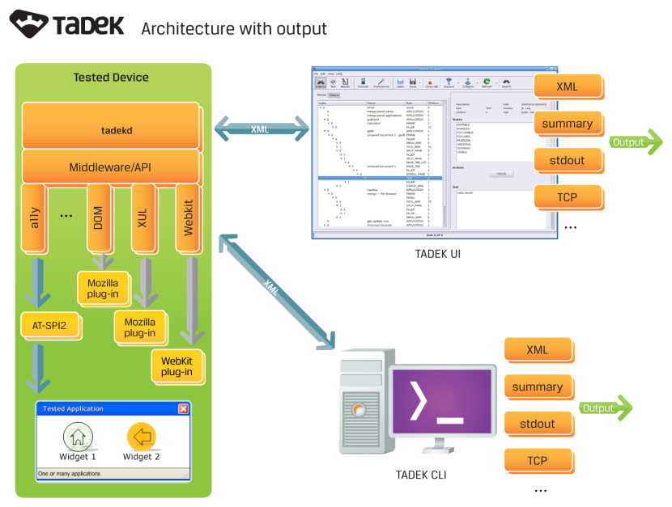
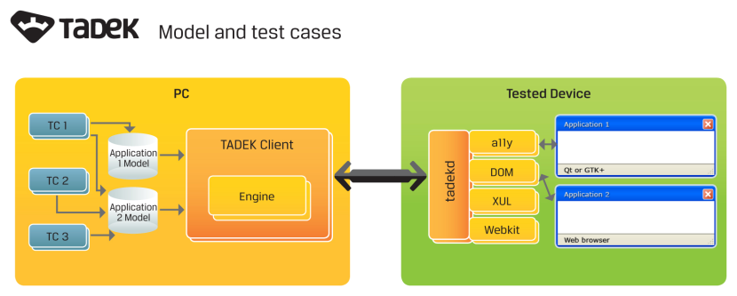

Overview
========

Quality control is a time and resource-consuming task which is quite often
neglected. Many people think testing adds no value to the project; no new
functionality is designed or implemented in this phase. It is tedious work and
the results are virtually invisible for the end user. However, everyone agrees
that quality matters. Nobody would use even the most sophisticated software if
it crashed often or behaved out of sync with the user's expectations. It is
clear that no serious project can succeed without thorough quality checks.

Like it or not, quality assurance usually costs a quite significant part of a
project budget, especially when executed manually. Manual work is priceless
when taking into account exploratory tests, but forcing people to run the same
set of test cases after every build is just a waste of money, people's
knowledge, and experience. Not to mention that after a few weeks of such a
repetitive task even the most dedicated engineer would start searching for
another job.

One can say that there are unit tests which seem to be quick and solid
solutions to those problems. Every function in the application code is tested
and proven to work according to the design. However, for some reasons when all
those functions are put together something bad happens and the end user
experiences problems not found in low-level testing.

What happened? How to prevent such situations? How to track them down as early
as possible to minimize bug fixing costs?

Fortunately, there is one answer to those questions -- automated end-user
testing. This approach imitates end-user interaction with an application
interface, just as if it were being used by a real, human operator. This seems
easy, but how to implement such tests? Build a robot to click on the screen,
and camera with artificial-intelligence software to read the resulting content?
Well, sometimes it is necessary but in most cases the same can be achieved with
much simpler, faster and cheaper tools.

**TADEK -- Test Automation in a Distributed Environment** -- is a new approach
to solving this problem and provides the means for automated end-user testing
of applications, without additional effort during implementation. TADEK is a
free and open-sourced solution, based on accessibility and similar
technologies, providing all that is required for exploring the content of
applications, writing test cases, running them, and reporting the results.
Application models and test cases are written in Python, making it simple to
learn and easy to extend. Client-server architecture allows parallel testing on
multiple devices, and drastically reduces resource consumption on tested
systems, which is always an issue for mobile devices or performance tests.
TADEK is also extremely user- friendly, due to the Qt-based GUI. However, a
command-line interface is also available, and can be used in continuous
integration systems, such as OBS.

The main goals of TADEK are:

* Providing a means for quality assurance of every project, even on a small scale
* Simple and rapid test implementation, with no change to the application code, in order to minimize the extra costs of QA
* Unified extensibility for provision of one common interface to many access technologies
* Maintainability for re-using the same test cases on different projects and platforms
* Flexibility to integrate with other systems, such as continuous integration

TADEK is not just an automated testing tool -- it is a full testing environment.
Apart from collecting and running test scenarios and assessing their outcomes,
it also watches for core dumps in case of crashes happening during testing.
It can use any native system command or script as a part of a test scenario.
The results are sent through output channels built as plug-ins, so it is
extremely easy to integrate it with other tools, for example test management or
reporting solutions.

TADEK in Small and Large Scale Projects
---------------------------------------

Regardless of the size of the project, the cost of quality assurance is always
significant. TADEK for end-user testing helps to reduce the cost, in both money
and time. Thanks to the access technologies on which TADEK is based, there is
no need to add any extra implementation to the application code. Control of the
application, and reading and assessing its output, are performed without a
single change to the application itself. Designers and developers can focus on
implementing functionality and not waste time on creating hooks for test tools.
Moreover, testers can perform tests on any application without access to its source
code. There is no need to re-compile the application with extra libraries -- all
that is needed are the same binary executable files as used in a real-life
scenario.

TADEK is a Python-based project. Its engine is written in Python and the test
cases are Python structures. This approach gives several advantages:

* Python is very easy to learn so there is no need for expensive training for test case developers
* If a user knows Python, he doesn't need to learn another syntax to write test cases
* It is simple to create extensions and add-ons
* It is an interpreted language -- test cases are ready to run right after they are written, without compilation, linking etc.

Multi-Application Scenarios
---------------------------
Virtually every device now on the market is capable of running multi-tasking,
multi-application processes. It is typical to browse the Internet while writing
mails or messages to friends in social networks, with favorite songs playing
on the music player application. TADEK allows to automate such scenarios even
when all those applications come from a different vendor. It is easy to test
interoperability -- for example opening a mail application after clicking a mail
address on a web page in a browser, filling out its content, sending it, then
checking new mail in one’s mailbox; or opening a URL in a browser from a
message sent from a friend through SMS or instant messaging application.

Architecture of TADEK
---------------------
TADEK has a built in client-server architecture, which means, among other
things:

* Parallel testing of multiple devices at once
* Lower memory and CPU footprint
* User-friendly Qt-based GUI or command-line interface used remotely from any PC, or locally through a localhost connection

On the platform under tests there is just a small daemon running as a server.
Since it is the client that controls the test execution, the server is very
light. It listens for a command from one or more clients and depending on its
type:

* Executes it through specified access technology
* Runs it in the system shell
* Copies files to or from the client
* Executes a custom command defined by a protocol extension

TADEK graphical user interface, a stand-alone application written with Qt is
its main client. There is also a command-line interface client providing
similar functionality as the GUI which can be, for example, used for combining
TADEK with continuous integration tools.

The server and the client communicate over TCP/IP using XML-based protocol.
Usually the client works on a separate PC -- especially in case of mobile device
testing when minimal resource consumption is crucial. It is also simply more
convenient to use a big screen to control testing process. However, there is
nothing preventing the client from being run directly on the tested platform.
This is pretty common when using a command-line interface client.

Accessing the Applications
--------------------------
How is it possible that TADEK can control applications without injecting any
code? Applications, especially those built with Qt or GTK+, consist of widgets
like buttons, menus, labels etc. If it is possible to access the widget it is
also possible to access any application which uses this widget.

Technology called accessibility (often abbreviated to a11y) focuses on
exposing systems' and applications' functionality and content to people with
disabilities. It provides interfaces which enable full access from other
software or hardware, like screen readers with speech synthesis, Braille,
magnification, etc. Accessibility is standardized by Open Accessibility Group,
part of the Linux Foundation, so all interfaces to applications and services
are unified even across different computing platforms. This feature also makes
it an ideal framework for automated testing.

TADEK uses accessibility to access application UI and content for automated
testing, or merely remote control. Some foundations are similar to Dogtail,
which also uses a11y, but the actual approach is very different, and
functionality is far wider. Even though accessibility is widely accepted as a
standard, not all widgets and application content elements have its interfaces
implemented. For example most web browsers do not expose page content as a set
of accessible widgets. Due to that limitation, TADEK was designed to use
virtually any possible way to control application content through access
plug-ins. Hence it is not limited to accessibility -- more plug-ins can be
developed.

TADEK has a separate middleware layer between the engine and the technology,
used for accessing application content. Test developers do not have to learn
each technology to write test cases -- TADEK provides a standard API, the same
for every technology, and all tests are written using just this API. It is the
middleware which translates TADEK’s API to the actual technology. Moreover,
different technologies can be used together, in one test case. Furthermore,
the user can create additional layers, and utilize them in a similar way to
those already available. An example for this can be accessing some content just
by taking screenshots and analyzing them when clicking just on X-Y coordinates.
Seems useless, but once implemented it can be used for any application,
regardless of the framework used to implement its user interface.

Parallel Testing and Scalability
--------------------------------
TADEK clients can connect many servers at once and run tests on all connected
devices in parallel. Neither extra equipment nor software is necessary -- it
comes down to connecting more devices to one client. TADEK will control all of
them at the same time, taking care of sending proper commands to the proper
device. In this way testing can be significantly accelerated -- the more devices
are connected the faster tests are executed. And there is no limit on the amount
of connected devices, which makes TADEK an extremely scalable solution -- for
example for those having a huge base of test scenarios to be run with every
integration round.
