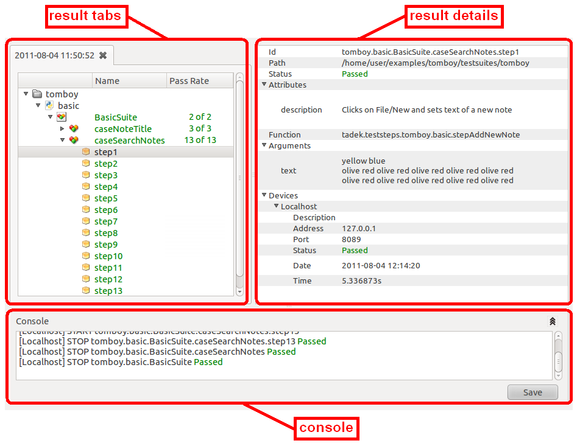
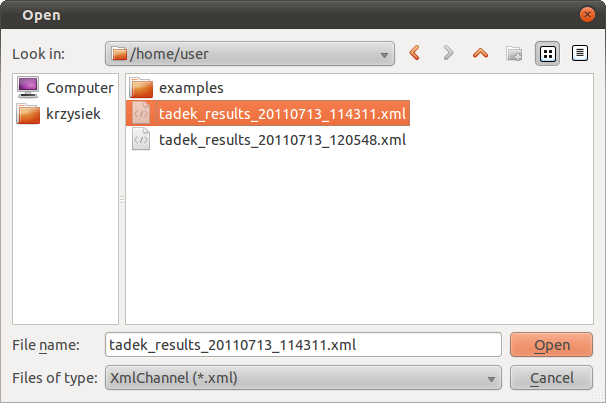

Test Results Analysis
*********************

Viewing test results in TADEK is intended to be easy and versatile. Each stage
of test execution -- steps, cases and suites is documented. Results can be
analyzed already while a test is taking place, to immediately see which steps
succeeded and which went wrong. What is more, all results can be automatically
stored for later verification.

.. _results_result_view:

Result View of tadek-ui
=======================

Result view is divided into three areas:

* *Result tabs* -- each tab shows a result tree that contains results of single execution of test cases. A tab can be either:

  * on-line -- it is added automatically and cannot be closed until the execution is finished. Tree items are updated while a test execution is running. The caption shows the date and time when execution started. 
  * off-line -- it is created after a result file is open.

* *Result details* -- a list containing detailed information on execution of a test step, test case or test suite:

  * *ID* -- dotted path that points to a suite/case/step inside a hierarchy of tests
  * *Path* -- disk path to a Python module where a suite/case/step is defined
  * *Status* -- indicates a status of a suite/case/step as ``Passed``, ``Failed``, ``Error``, ``Not Completed``, ``No Run``
  * *Attributes* -- additional attributes defined as:

    * keyword arguments of *testStep* decorator
    * keyword arguments passed to constructor of *TestCase* class
    * custom class attributes of *TestSuite* class that are not instances of *TestCase* class

  * *Function* -- name of a test step function
  * *Arguments* -- keyword arguments provided to a test step function
  * *Devices* -- information on each device that a suite/case/step was executed on. It includes name, address, port and status.

* *Console* -- a widget that shows log messages when a test suite/case/step starts or finishes execution. It can be folded and unfolded by clicking |result_hide| and |result_show| buttons. The logs can be saved to a text file by clicking *Save* button.

.. |result_module| image:: images/result/text-x-python.png

.. |result_case| image:: images/result/inode-blockdevice.png

The icons in a test tree indicate: 

    * |result_folder| -- a Python package
    * |result_module| -- a Python module
    * |result_suite| -- a test suite
    * |result_case| -- a test case
    * |result_step| -- a test step

Result Channels
===============

Result channels is a mechanism of providing test results in a flexible way.
While tests are being executed, a channel is informed about partial results of
each step, case or suite. The channel can handle these events arbitrarily, e.g.
by printing them to console, writing to a file, sending a message through a
network or to another program. A set of predefined channels include:

* :ref:`results_xml_channel`
* :ref:`results_stream_channel`

A channel can be enabled or disabled by changing appropriate setting in the
:ref:`configuration <configuration_default>`.

.. _results_xml_channel:

XML Channel
-----------

The XML channel produces an XML document containing all available details on
test execution with preserved hierarchy of test steps/cases/suites.

Providing the channel is enabled, the output file is created in the directory
from where tadek-ui or tadek are launched. By default, the file is named
*tadek_results_YYYYMMDD_HHMMSS.xml* where *YYYYMMDD_HHMMSS* represent
date and time of creation of the file. This guarantees that the file name is
unique. Name and uniqueness of the file as well as the verbosity of the channel
can be changed in the :ref:`configuration <configuration_default>`.

It is a loadable channel, meaning that once an XML file is generated, it can be
loaded into the Result view of tadek-ui and browsed -- just like the results
that are automatically filled by tadek-ui itself while test cases are being
executed. The :menuselection:`File --> Open` menu option opens a dialog:

The XML results of execution of test case *caseAddNote* from
*tomboy.basic.BasicSuite* test suite is presented below (*tomboy* location
can be found in the :ref:`examples <installation_examples>`):

.. code-block:: xml

    <?xml version='1.0' encoding='utf-8'?>
    <results>
        <suite>
            <id>tomboy.basic.BasicSuite</id>
            <path>/home/user/examples/tomboy/testsuites/tomboy</path>
            <attributes>
                <description>Tests basic functionalities of the Tomboy application</description>
            </attributes>
            <devices>
                <device>
                    <status>Passed</status>
                    <name>Localhost</name>
                    <time>16.214208</time>
                    <address>127.0.0.1</address>
                    <port>8089</port>
                    <date>2011-07-13 12:05:48</date>
                    <description />
                    <errors />
                </device>
            </devices>
            <children>
                <case>
                    <id>tomboy.basic.BasicSuite.caseAddNote</id>
                    <path>/home/user/examples/tomboy/testsuites/tomboy</path>
                    <attributes>
                        <description>Adds a note</description>
                    </attributes>
                    <devices>
                        <device>
                            <status>Passed</status>
                            <name>Localhost</name>
                            <time>16.206236</time>
                            <address>127.0.0.1</address>
                            <port>8089</port>
                            <date>2011-07-13 12:05:48</date>
                            <description />
                            <errors />
                        </device>
                    </devices>
                    <children>
                        <step>
                            <id>tomboy.basic.BasicSuite.caseAddNote.step1</id>
                            <path>/home/user/examples/tomboy/testsuites/tomboy</path>
                            <function>tadek.teststeps.tomboy.basic.stepAddNewNote</function>
                            <arguments>
                                <text>None</text>
                            </arguments>
                            <attributes>
                                <description>Clicks on File/New and sets text of a new note</description>
                            </attributes>
                            <devices>
                                <device>
                                    <status>Passed</status>
                                    <name>Localhost</name>
                                    <time>3.806847</time>
                                    <address>127.0.0.1</address>
                                    <port>8089</port>
                                    <date>2011-07-13 12:05:53</date>
                                    <description />
                                    <errors />
                                </device>
                            </devices>
                            <children />
                        </step>
                        <step>
                            <id>tomboy.basic.BasicSuite.caseAddNote.step2</id>
                            <path>/home/user/examples/tomboy/testsuites/tomboy</path>
                            <function>tadek.teststeps.tomboy.basic.stepCheckNoteList</function>
                            <arguments>
                                <list>['New Note 1']</list>
                            </arguments>
                            <attributes>
                                <description>Checks if list of notes contain all provided entries</description>
                            </attributes>
                            <devices>
                                <device>
                                    <status>Passed</status>
                                    <name>Localhost</name>
                                    <time>5.277995</time>
                                    <address>127.0.0.1</address>
                                    <port>8089</port>
                                    <date>2011-07-13 12:05:56</date>
                                    <description />
                                    <errors />
                                </device>
                            </devices>
                            <children />
                        </step>
                    </children>
                </case>
            </children>
        </suite>
    </results>

.. _results_stream_channel:

Stream Channel
--------------

The stream channel writes results to *stderr* stream as messages about starts
and stops of a test step/case/suite. By default, only starts and stops of test
cases are printed. The verbosity can be enabled in the configuration.

The output of a default Stream channel for the execution of test case
*caseAddNote* from *tomboy.basic.BasicSuite*::

    START->	[Localhost] tomboy.basic.BasicSuite.caseAddNote
    STOP ->	[Localhost] tomboy.basic.BasicSuite.caseAddNote: PASSED

A fragment of the output of a verbose Stream channel for the same test case::

    ------------------------------------------------------------------------------
    STOP ->     common->        class-> TestCase
    STOP ->     common->        id->    tomboy.basic.BasicSuite.caseAddNote
    STOP ->     common->        path->  /home/user/examples/tomboy/testsuites/tomboy
    STOP ->     attributes->    description->   Adds a note
    STOP ->     - - - - - - - - -
    STOP ->     devices->       status->        Passed
    STOP ->     devices->       name->  Localhost
    STOP ->     devices->       time->  16.254358
    STOP ->     devices->       date->  2011-07-13 15:39:27
    STOP ->     devices->       address->       127.0.0.1
    STOP ->     devices->       port->  8089
    STOP ->     devices->       description->   
    STOP ->     - - - - - - - - -
    ------------------------------------------------------------------------------

Monitoring Core Dumps
=====================

TADEK has a feature for monitoring core dump files on remote devices. The user
can specify which directories to look in and a name pattern of searched files.
If such file is created during a test execution, it will be reported in test
results under the *device* section related to respective device. Detailed
description of available configuration options can be found in the
:ref:`configuration_default` section.
