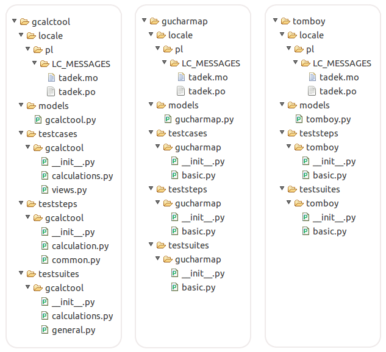
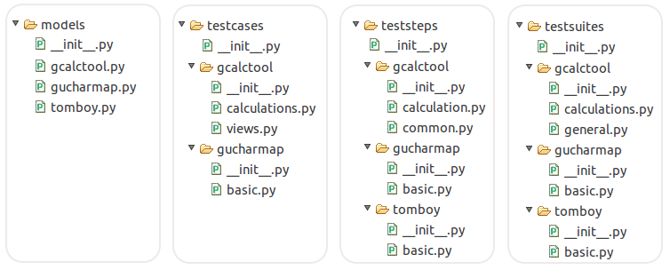
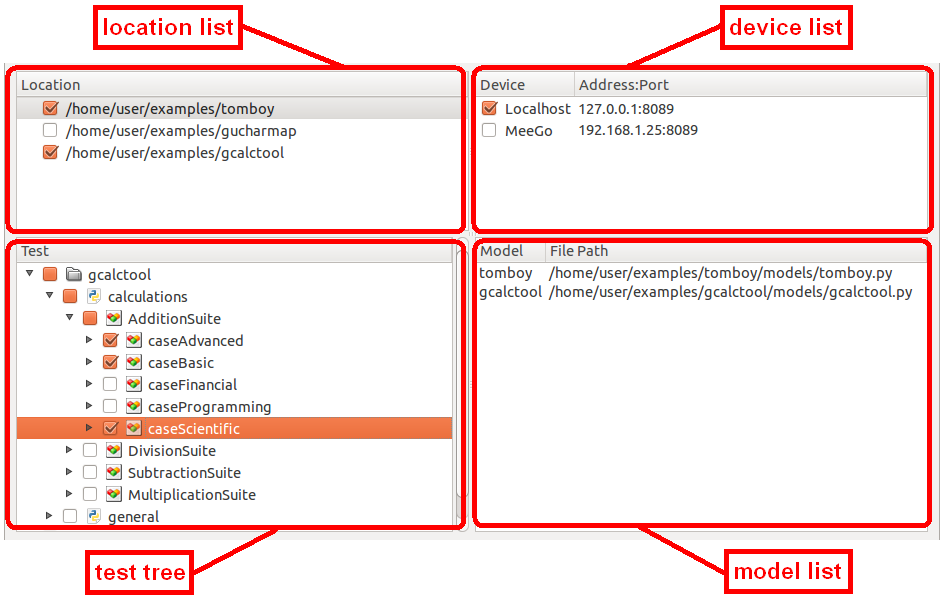
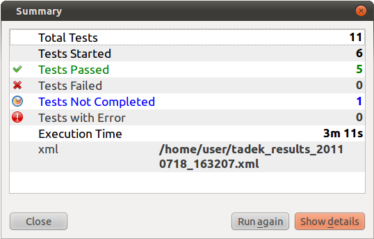

.. _running:

Running Tests
*************

.. _running_locations:

Test Locations
==============

TADEK aims to keep the testing process well organized. For that reason, TADEK
comes with test locations. A test location is a directory that contains
test data of a tested application or a set of related applications. Test data
in a location can be grouped in the following subdirectories:

* *models* -- a place for modules with classes of application models
* *teststeps* -- a place for modules with definitions of test steps
* *testcases* -- a place for modules with test cases containing test steps
* *testsuites* -- a place for modules with classes of test suites containing test cases, which unlike test steps or test cases are ready to be loaded and executed by the TADEK's test engine
* *locale* -- a place for storing localization files

These above subdirectories, except the *locale* directory, are treated by TADEK
as parts of *tadek.models*, *tadek.teststeps*, *tadek.testcases* and
*tadek.testsuites* packages. Thanks to that, modules contained in any location
can be imported in any module from any location using appropriate package prefix.
Of course, these subdirectories can contain additional packages as any other
Python package.

In fact, contents of corresponding subdirectories of all locations are
merged by TADEK's engine, so to avoid name conflicts within one Python package,
modules inside *teststeps*, *testcases* and *testsuites* location subdirectories
should be placed in Python packages. Names of such packages usually correspond
to tested applications or source locations.

The example below shows a sample structure of three locations:

The merged contents of these three locations will look as below:

Not all of possible location subdirectories are required. Only one of these
directories is needed to make some directory a TADEK test location. It is
nothing wrong to define test steps together with test suites and test cases and
locate them all in the *testsuites* location subdirectory. But on the other hand,
test steps, test cases and test suites stored separately are easier to maintain
or extend, e.g. by adding more modules with test steps split by categories.

The most crucial thing here is that TADEK loads only these test suites, which
are defined directly in the *testsuites* location subdirectory.

Test View of tadek-ui
=====================

Test view is divided into four areas:

.. |folder| image:: images/test/folder-grey.png

.. |suite| image:: images/test/source_moc.png

* *Location list* -- contains locations that were added using *Add* action. Whether an item is checked or not determines if test suites form *testsuites* subdirectory of a location should be included in the test tree.
* *Device list* -- contains names of currently connected devices. Whether an item is checked or not determines whether to run test cases on a device or not in upcoming test execution. It is also possible to change selection while the the execution is running.
* *Test tree* -- contains hierarchies of test suites from currently selected locations. Items represent subdirectories inside *testsuites* directory of a location [|folder|], Python modules [|module|] and packages [|folder|], test suites [|suite|] and test cases [|case|]. Item can be selected to include it in upcoming execution.
* *Model list* -- contains names of all models located inside *models* subdirectories of currently selected locations along with paths to modules where their definitions reside.

To execute test cases in tadek-ui:

* Add a location where test cases are defined using the *Add* action
* Enable the location by checking an item on the locations list
* Check some test cases in the test tree
* Connect a device in :ref:`Manage Devices <environment_manage_devices_dialog>` dialog
* Check the device on the device list
* Click the *Start* action

.. hint::
    The number of completed test cases is shown in the status bar. Detailed
    information on status of test cases that are being executed can be obtained
    in the :ref:`Result view <results_result_view>`.

After the execution is finished or stopped, a summary window appears:

It informs about:

* Total number of tests that were selected to run
* Total number of tests that have been started
* Total number of tests that have passed, failed, not completed or raised an error
* Total time of execution
* Path to report file (if the :ref:`XML channel <results_xml_channel>` is enabled)

*Run again* button starts the execution anew and *Show details* button switches to Result view and shows a detailed report.

tadek-runner Command-Line Tool
==============================

tadek-runner is a tool for execution of test cases written with TADEK. Tests cases can be executed locally or remotely on specified devices.

Usage::

    tadek-runner [OPTION]... [TESTPATH]...

The *TESTPATH* argument specifies a logical path to a test case or a test suite. It can be provided more than once. If the location is set to e.g. */home/user/tests/myapp*, then:

* *basic* points to all test suites and test cases contained in */home/user/tests/myapp/testsuites/basic.py*
* *basic.MenuTests* points to the test suite *MenuTests* contained in */home/user/tests/myapp/testsuites/basic.py*
* *bugs.other.AboutBox.wrongVersion* points to the *wrongVersion* test case inside the *AboutBox* test suite contained in */home/user/tests/myapp/testsuites/bugs/other.py*

If no *TESTPATH* arguments are provided, all test suites from specified locations will be executed. The default directory of test cases is located inside the tadek package directory, e.g. */usr/local/lib/python2.6/dist-packages/tadek/testsuites*.

Options
-------

.. program:: tadek-runner

.. cmdoption:: --version

    Show program's version number and exit.

.. cmdoption:: -h, --help

    Show this help message and exit.

.. cmdoption:: -d DEVICE, --device=DEVICE

    OPTIONAL. Specify a device on which tests will run. The device can be specified in two different ways: device name from configuration file devices.conf or as IP[:port(default 8089)]. If there is no device specified, a default device 127.0.0.1:8089 will be used. This option can be used multiple times.

.. cmdoption:: -l LOCATION, --location=LOCATION

    OPTIONAL. Specify location of test case directories. Paths can be relative or absolute. It can be used multiple times.

Examples
--------

Running all test cases from ``examples/gucharmap`` location on default device (output was truncated to fit here)::

    $ tadek-runner -l examples/gucharmap
      Loaded 8 tests from BasicTestsSuite
      Loaded 7 tests from ExtraTestsSuite
      Loaded 4 tests from CopyPasteTestsSuite
    ----------------------------- LOADED 19 TEST CASES -----------------------------

    START->	[localhost] gucharmap.basic.BasicTestsSuite.caseEnterDigits
    STOP ->	[localhost] gucharmap.basic.BasicTestsSuite.caseEnterDigits: PASSED
    START->	[localhost] gucharmap.basic.BasicTestsSuite.caseEnterLetters1
    STOP ->	[localhost] gucharmap.basic.BasicTestsSuite.caseEnterLetters1: PASSED
    START->	[localhost] gucharmap.basic.BasicTestsSuite.caseEnterLetters2
    STOP ->	[localhost] gucharmap.basic.BasicTestsSuite.caseEnterLetters2: PASSED
    START->	[localhost] gucharmap.basic.BasicTestsSuite.caseEnterLetters3
    STOP ->	[localhost] gucharmap.basic.BasicTestsSuite.caseEnterLetters3: PASSED
    START->	[localhost] gucharmap.basic.BasicTestsSuite.caseEnterLettersDigits
    STOP ->	[localhost] gucharmap.basic.BasicTestsSuite.caseEnterLettersDigits: PASSED
    START->	[localhost] gucharmap.basic.BasicTestsSuite.caseRunClose
    STOP ->	[localhost] gucharmap.basic.BasicTestsSuite.caseRunClose: PASSED
    
    ...

    Ran 19 of 19 test cases.
    Run time:	10m 3s
    Passed:		18
    Failed:		1
    Not completed:	0
    Errors:		0
    --------------------------------------------------------------------------------
    Result file:
        /home/user/tadek_results_20110606_094733.xml
    --------------------------------------------------------------------------------

Running ``caseAddNote`` test case from ``tomboy.basic.BasicSuite`` placed in ``examples/tomboy`` location::

    $ tadek-runner -l examples/tomboy -d testdevice tomboy.basic.BasicSuite.caseAddNote
      Loaded 1 tests from BasicSuite
    ----------------------------- LOADED 1 TEST CASES ------------------------------

    START->	[testdevice] tomboy.basic.BasicSuite.caseAddNote
    STOP ->	[testdevice] tomboy.basic.BasicSuite.caseAddNote: PASSED

    Ran 1 of 1 test cases.
    Run time:	17s
    Passed:		1
    Failed:		0
    Not completed:	0
    Errors:		0
    --------------------------------------------------------------------------------
    Result file:
        /home/user/tadek_results_20110606_093701.xml
    --------------------------------------------------------------------------------
